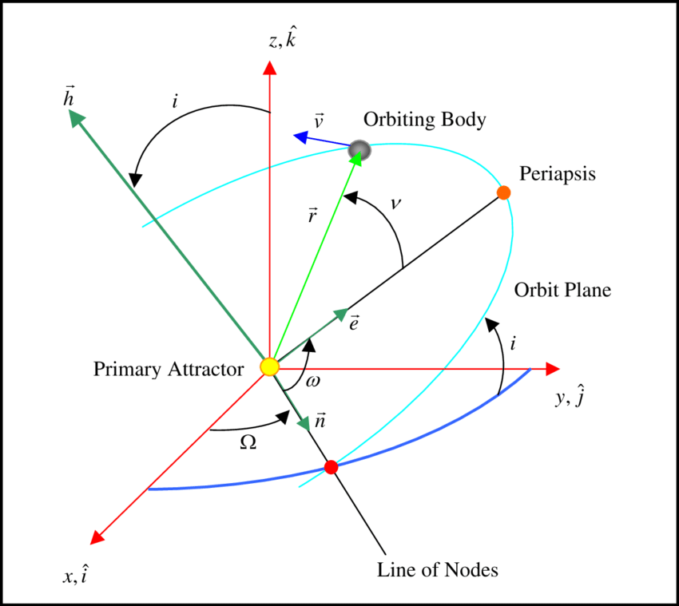

## Introduction

{width=80%}

When describing a satellite’s orbit, we have two common approaches:

**State vectors:** position $\mathbf{r}$ and velocity $\mathbf{v}$ at a given instant.

**Classical Orbital Elements (COEs):** Six geometric parameters that define the shape and orientation of the orbit.

1. Eccentricity ($\mathbf{e}$)
2. Inclination ($i$)
3. Right Ascension of the ascending node ($\Omega$)
4. Argument of Perigee ($\omega$)
5. True Anomaly ($\nu$)
6. Semi-major axis ($a$)

This post walks through computing COEs from state vectors in Python using NumPy.

To keep the workflow reproducible and easy to integrate, the program reads inputs and writes outputs in YAML. YAML is human-readable, machine-parseable, and widely used in configuration files, which makes it ideal for storing both raw inputs and structured outputs.

The code:

1. Reads the position and velocity vectors from a YAML file.

2. Produces outputs in three ways:

    - Stored in a Python dictionary (full float64 precision).

    - Printed on screen (rounded to 2 decimals for readability).

    - Written back to a YAML file (full float64 precision).

All project files are available on All project files are available on [GitHub](https://github.com/puttym/adcs_tools/tree/main/orbital_elements).

## Step 1 — Setting up the Class

```python
class ClassicalOrbitalElements:
    """
    Computes the Classical Orbital Elements (COEs) from a position
    and velocity state vector.
    """

    def __init__(self, position, velocity, mu=MU_EARTH):
        self.r = np.array(position, dtype=float)
        self.v = np.array(velocity, dtype=float)
        self.mu = mu
        self.coe = None

        self._validate_input()
```
The ```__init__``` method is the constructor of the class. It runs automatically whenever a new object is created. Line by line:

```self.r = np.array(position, dtype=float)``` → converts the input position list into a NumPy array of floats and stores it inside the object.

```self.v = np.array(velocity, dtype=float)``` → does the same for the velocity vector.

```self.mu = mu``` → stores the gravitational parameter, defaulting to Earth’s $\mu$.

```self.coe = None``` → initializes the orbital elements; they’ll be computed later.

```self._validate_input()``` → calls a helper method to make sure the inputs are valid before proceeding.

This ensures every object starts with clean, checked data.


### Why ```self``` appears everywhere
In Python, self is a reference to the object being created.
When we write:
```python
self.r = np.array(position)
```
we are **saving the position vector inside the object** so other methods can reuse it. Each instance of ```ClassicalOrbitalElements``` carries its own memory of $\vec{r}$, $\vec{v}$, and computed elements.

## Step 2 - Input Validation
```python
def _validate_input(self):
    if np.allclose(self.r, 0):
        raise ValueError("Position vector cannot be zero.")
    if np.allclose(self.v, 0):
        raise ValueError("Velocity vector cannot be zero.")
    if not np.isfinite(self.r).all() or not np.isfinite(self.v).all():
        raise ValueError("Position and velocity must contain finite numbers.")
```

The leading underscore (```_validate_input```) is a Python naming convention that signals this is an internal method. It’s not meant to be called by users of the class but rather used only inside the class itself.

```np.allclose()```

```np.allclose(arr, 0)``` checks whether every element of arr is close to zero within a default tolerance (```rtol=1e-05```, ```atol=1e-08```).

**Examples:**
```python
np.allclose([0.0, 0.0, 0.0], 0)   # True
np.allclose([1e-12, 0.0, 0.0], 0) # True
np.allclose([1e-3, 0.0, 0.0], 0)  # False
```

This prevents “almost-zero” vectors that would make orbital elements undefined.

For more details on ```np.allclose()``` please refer to the documentation
[here](https://numpy.org/devdocs/reference/generated/numpy.allclose.html).

```np.isfinite()```

This checks whether numbers are finite (not $\infty$ or ```NaN```).

Examples:
```python
np.isfinite([1.0, np.inf, np.nan])
# → array([ True, False, False ])
```

Using ```.all()``` lets us check every element:
```python
np.isfinite([1.0, 2.0, np.inf]).all()
# → False (because of the infinity)
```
This protects us against corrupted inputs like infinite velocity.

## Step 3 — Angular Momentum and Inclination
```python
h_vec = np.cross(r, v)
h = np.linalg.norm(h_vec)
i = np.degrees(safe_arccos(h_vec[2] / h))
```
The **specific angular momentum** is:

$$
\mathbf{h} = \mathbf{r} \times \mathbf{v}.
$$

Its magnitude $|\vec{h}|$ is constant for Keplerian motion.

Inclination $i$ is the tilt of the orbital plane:

$$
i = \cos^{-1}\left(\frac{h_z}{h}\right).
$$

## Step 4 — Node Vector and RAAN
```python
k_hat = np.array([0, 0, 1])
n_vec = np.cross(k_hat, h_vec)
n = np.linalg.norm(n_vec)

if n != 0:
    RAAN = np.degrees(safe_arccos(n_vec[0] / n))
    if n_vec[1] < 0:
        RAAN = 360 - RAAN
else:
    RAAN = np.nan
```

The **node vector**

$$
\mathbf{n} = \mathbf{k} \times \mathbf{h}
$$

points to the ascending node ($\mathbf{k} = [0, 0, 1]$).

The **Right Ascension of the Ascending Node (RAAN)** is:

$$
\Omega = \cos^{-1}\left(\frac{n_x}{n}\right)
$$

If $n_y < 0$, we flip to $360^\circ - \Omega$.

When $i \approx 0^\circ$ (equatorial orbit), the node line is undefined.
We return ```NaN``` instead of zero — because zero would falsely suggest a meaningful direction. ```NaN``` makes it explicit: RAAN is not defined in this case.

## Step 5 - Eccentricity Vector
```python
e_vec = (1/mu) * ((v_norm**2 - mu/r_norm)*r - np.dot(r, v)*v)
e = np.linalg.norm(e_vec)
```

Add equation
$$
\mathbf{e} = \frac{1}{\mu} 
\left[ (v^2 - \tfrac{\mu}{r})\mathbf{r} - (\mathbf{r}\cdot \mathbf{v})\mathbf{v} \right]
$$

The magnitude $e = |\vec{e}|$ defines orbit shape:

- $e=0$: circle

- $0<e<1$: ellipse

- $e=1$: parabola

- $e>1$: hyperbola

## Step 6 — Argument of Perigee and True Anomaly
```python
if n != 0 and e > 1e-8:
    omega = np.degrees(safe_arccos(np.dot(n_vec, e_vec) / (n * e)))
    if e_vec[2] < 0:
        omega = 360 - omega
else:
    omega = np.nan
```

$$
\omega = \cos^{-1}\left( \frac{\mathbf{n}\cdot \mathbf{e}}{n e} \right),
\quad
\text{if } e_z < 0 \;\;\Rightarrow\;\; \omega = 2\pi - \omega
$$

But if $e \approx 0$, the direction of perigee is meaningless → we return NaN.
Again, ```NaN``` is better than zero because zero would wrongly suggest perigee lies on the x-axis.

For the true anomaly $\nu$:

$$
\nu = \cos^{-1}\left( \frac{\mathbf{e}\cdot \mathbf{r}}{e r} \right)
$$

If $\vec{r}\cdot\vec{v} < 0$, we take $360^\circ - \nu$.
If $e \approx 0$, we compute $\nu$ relative to $\vec{n}$, unless the orbit is both circular and equatorial — in which case $\nu$ is undefined.

For circular orbits ($e \approx 0$), ($\nu$) is measured from the node vector ($\mathbf{n}$).

## Step 7 — Semi-major Axis
```python
energy = v_norm**2 / 2 - mu / r_norm
a = -mu / (2 * energy)
```

From specific orbital energy:

$$
\varepsilon = \frac{v^2}{2} - \frac{\mu}{r}
$$

$$
a = -\frac{\mu}{2\varepsilon}
$$
If $\epsilon \to 0$ (parabolic trajectory), $a \to \infty$.

## Step 8 — Safe arccos with ```np.clip```
Why do we need safe_arccos()?

Example:

```python
x = 1.0000000002
np.arccos(x)   # ValueError
safe_arccos(x) # Works fine
```
By clamping values into $[-1, 1]$, np.clip ensures we never hit numerical errors even when floating-point rounding pushes us slightly out of bounds.

## Step 9 — Summarizing Results
```python
coe = {
    "h (km^2/s)": h,
    "a (km)": a,
    "i (deg)": i,
    "RAAN (deg)": RAAN,
    "e": e,
    "omega (deg)": omega,
    "nu (deg)": nu,
}
```

We print the table using ```tabulate```:
```scss
╒═══════════════╤══════════════╕
│ Element       │ Value        │
├───────────────┼──────────────┤
│ h (km^2/s)    │ 52822.346304 │
│ a (km)        │ 7000.000000  │
│ i (deg)       │ 28.500000    │
│ RAAN (deg)    │ 45.000000    │
│ e             │ 0.010000     │
│ omega (deg)   │ 90.000000    │
│ nu (deg)      │ 120.000000   │
╘═══════════════╧══════════════╛
```

## Writing output to YAML
```python
def save_to_yaml(self, filename="coe_output.yaml"):
        if self.coe is None:
            raise RuntimeError("COEs not yet calculated. Call calculate() first.")

        with open(filename, "w") as f:
            yaml.dump(self.coe, f, default_flow_style=False)

        print(f"COEs saved to {filename}")
```

This method saves the computed COEs into a YAML file.

- ```if self.coe is None```: → safety check: don’t save until COEs are actually calculated.

- ```with open(filename, "w") as f```: → opens the target file in write mode.

- ```yaml.dump(self.coe, f, default_flow_style=False)``` → writes the Python dictionary self.coe to the file:

    - ```self.coe```: the data being written.

    - ```f```: the open file handle.

    - ```default_flow_style=False```: ensures YAML is written in block style (easy to read), rather than inline JSON-like style.

This produces a clean, shareable configuration-style output.

## The calling program

```python
import yaml
from core import ClassicalOrbitalElements

def main():
    # Load state vector from YAML
    with open("config.yaml", "r") as f:
        config = yaml.safe_load(f)

    position = config["state_vector"]["position"]
    velocity = config["state_vector"]["velocity"]

    coe_calc = ClassicalOrbitalElements(position, velocity)
    coe_calc.calculate()
    coe_calc.summary()
    coe_calc.save_to_yaml("orbit_output.yaml")

if __name__ == "__main__":
    main()
```

This is the driver script. Its job is to:

1. Read the input state vectors from config.yaml.

2. Create a ClassicalOrbitalElements object with the data.

3. Compute, summarize, and save the results.

Separating this into a main.py is good practice:

- Keeps the class code clean and reusable.

- Lets us change how we call the class (e.g., from CLI or tests) without modifying the core logic.

- Mirrors real-world software projects where library code and application entry points are distinct.

***AI Attribution:*** A few weeks ago, I had written a function to compute COEs from a satellite’s state vector. I shared it with AI and asked to reframe it using Python classes, dictionaries, and YAML as an exercise. The AI refactored the function into a clean, class-based design with modular files, design docs, and tests. What started as a single function evolved into something much closer to industry-level code. In this post, I focused on the core class; in later posts, I’ll cover documentation and testing.