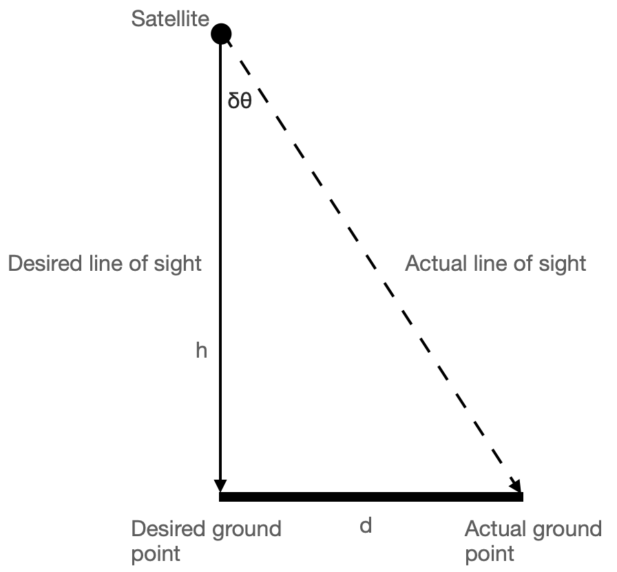

When we talk about spacecraft orientation, we are really describing how one coordinate frame — the spacecraft’s body frame — is oriented relative to some inertial reference. Orientation itself cannot be *measured* directly; it must be *inferred* from sensors that observe vectors in space, such as the direction of the Sun, the Earth’s magnetic field, or the position of stars.

This post explores how that inference happens in real missions, how accuracy is characterized and affected by the space environment, and how multiple sensors work together to meet mission needs.

## 1. The Rotation Matrix: Connecting Frames

The relationship between a vector expressed in the inertial frame ($i$) and the spacecraft body frame ($b$) is given by the rotation matrix $\mathbf{R}_{b/i}$:

$$
\mathbf{r}_b = \mathbf{R}_{b/i}\,\mathbf{r}_i
$$

Here $\mathbf{r}_i$ and $\mathbf{r}_b$ represent the same physical vector (say, the Sun’s direction) as seen from different frames.

If we use Euler angles $(\phi, \theta, \psi)$ representing roll, pitch, and yaw, we can write:

$$
\mathbf{R}_{b/i} = R_z(\psi)\,R_y(\theta)\,R_x(\phi)
$$

Each rotation matrix $R_x$, $R_y$, and $R_z$ describes a rotation about the respective body axes.

In principle, if we can measure enough independent reference vectors in space, we can solve for $\mathbf{R}_{b/i}$ — that is, determine the spacecraft’s attitude. But these measurements are never perfect. Next, we see how measurement errors translate into performance errors — how small attitude uncertainties show up as motion or blur on the ground.

## 2. Accuracy, Resolution, and Noise

Every attitude sensor tries to measure some physical vector or angular rate, but the reading is always an approximation of the truth:

$$
x = x_\text{true} + b + n
$$

where

- $b$ is **bias** (a fixed offset),
- $n$ is **noise** (random variation, often modeled as zero-mean Gaussian), and
- $x_\text{true}$ is the true value.

We never know $x_\text{true}$ directly — it represents the physical quantity the sensor is trying to measure. The equation shows how the measured value differs from the truth because of bias and noise. If we can estimate these imperfections, we can correct the measurement.

**Resolution** refers to the smallest change the sensor can detect.

**Accuracy** reflects how close the measurement is to the true value.

**Precision** (or repeatability) tells us how consistent the readings are.

Statistically, we describe uncertainty with the **standard deviation** $\sigma$. For independent error sources, variances add up:

$$
\sigma_\text{total}^2 = \sigma_\text{bias}^2 + \sigma_\text{noise}^2 + \sigma_\text{thermal}^2 + \dots
$$

### How Accuracy is Measured on Earth

Before flight, sensors are calibrated in controlled environments:

- **Gyros** are mounted on precision turntables to measure drift and scale factor errors.
- **Magnetometers** are tested in Helmholtz coils that generate uniform magnetic fields.
- **Star trackers** are aligned against optical benches and celestial simulators.

The resulting data characterize bias, noise spectrum, and thermal sensitivity.

### How the Space Environment Affects Accuracy

Once in orbit, the same sensors face a new reality:

- **Vibrations and micro-vibrations** from reaction wheels or control moment gyros (CMGs) introduce dynamic bias and jitter.
- **Thermal cycling** causes expansion and contraction, altering alignment between sensors and the spacecraft structure.
- **Magnetic torquers**, used for attitude control, create local magnetic fields that disturb magnetometers.
- **Liquid sloshing** in fuel tanks adds small but unpredictable accelerations sensed as noise by gyros or accelerometers.

### A Closer Look at Thermal Cycling

Thermal cycling occurs because spacecraft repeatedly move in and out of sunlight every orbit.

When exposed to the Sun, external surfaces can heat up beyond **+120 °C**; during eclipse (Earth’s shadow), they can plunge below **–150 °C**.

These extreme swings happen every 45–60 minutes in low Earth orbit.

Even with multilayer insulation and radiators, structural parts expand and contract slightly with temperature — misaligning sensors by arcseconds to arcminutes over time.

Such thermal distortions are a key source of slow, cyclic errors in high-accuracy missions.

## 3. From Accuracy to Mission Requirements

### A Generic Earth-Imaging Satellite

{width=50%}

Imagine a satellite imaging the Earth from 700 km altitude with a ground pixel size of 10 m.

A ground pixel size of 10 m means that two adjacent pixels in the image correspond to points 10 m apart on the ground — this single dimension defines the instrument’s linear resolution.

This means each pixel in the captured image corresponds to a **10 m × 10 m patch** on the Earth’s surface.

The smallest angular resolution corresponding to one pixel is:

$$
\theta_\text{pixel} = \frac{10}{700{,}000} \approx 1.4\times10^{-5}\,\text{rad} \approx 0.0008^\circ
$$

Here we used the **small-angle approximation** $\tan\theta \approx \theta$ (for $\theta$ in radian), which holds very well for spacecraft pointing angles.

To avoid blurring, the pointing error must be a fraction of this — typically one-third to one-fifth:

$$
\delta\theta_\text{acceptable} \approx k\,\frac{x}{h}, \quad k \in [0.2, 0.3]
$$

where $x$ is the ground pixel size and $h$ is the orbital altitude.

For $x = 10$ m, $h = 700{,}000$ m, and $k = 1/3$,

$$
\delta\theta_\text{acceptable} \approx \frac{1}{3}\times\frac{10}{700{,}000} \approx 4.8\times10^{-6}\,\text{rad} = 0.00027^\circ
$$

≈ 1 arcsecond — the required accuracy for such an imaging payload.

If the spacecraft’s **pointing error** is $\delta\theta$, the **ground-pointing error** $d$ is approximately:

$$
d \approx h\,\delta\theta
$$

This also uses $\tan\delta\theta \approx \delta\theta$ for small $\delta\theta$.

For example, $\delta\theta = 0.01^\circ = 1.7\times10^{-4}\,\text{rad}$ gives:

$$
d = 700{,}000 \times 1.7\times10^{-4} \approx 120\,\text{m}
$$

A 0.01° pointing error therefore shifts the ground target by 120 m — clearly unacceptable for a 10 m pixel instrument.

### Real-Mission Example: Sentinel-2

ESA’s Sentinel-2 carries multispectral cameras with 10 m ground resolution.

To achieve this precision, it uses:

- **Star trackers** for absolute attitude (few-arcsecond accuracy)
- **Gyros** for short-term propagation (high-rate updates)
- **Coarse Sun sensors** and **magnetometers** for safe-mode and redundancy

The star tracker provides absolute attitude measurements at regular intervals (for example, once per second), while gyros fill in the gaps in between.

Some missions use **periodic star-tracker updates** rather than continuous operation — activating the star camera intermittently to correct gyro drift, reducing power and thermal load.

Together, these sensors keep the pointing stability within imaging requirements. Pointing stability refers to how much the line of sight jitters over time — typically quantified by the standard deviation of pointing error.

### Combining Multiple Sensors: Statistics and Geometry

Adding sensors isn’t just about accuracy — it’s also about geometry.

A single vector measurement (e.g., Sun direction) defines a *cone* of possible attitudes around that vector.

The spacecraft can rotate freely about that axis without changing the measured direction — hence the cone.

To fix the full 3-D orientation, we need at least **two non-collinear reference vectors**, such as the Sun direction and the Earth’s magnetic field.

Statistically, when two independent sensors provide estimates $x_1$ and $x_2$ with variances $\sigma_1^2$ and $\sigma_2^2$, the best fused estimate is the weighted average:

$$
\hat{x} = \frac{x_1/\sigma_1^2 + x_2/\sigma_2^2}{1/\sigma_1^2 + 1/\sigma_2^2}
$$

and the resulting uncertainty is smaller than either alone:

$$
\sigma_\text{fused}^2 = \left(\frac{1}{\sigma_1^2} + \frac{1}{\sigma_2^2}\right)^{-1}
$$

For attitude estimation, this principle extends naturally — each sensor contributes its estimate with a weight proportional to its reliability.

Modern algorithms such as the **QUEST** and **Kalman filters** apply these principles to merge data from multiple sensors, yielding smooth, high-accuracy estimates that respect both geometry and uncertainty.

### Why Not Every Mission Needs a Star Sensor

Even if a mission could afford a star tracker, it might not *need* one:

- **CubeSats** doing technology demonstrations or communication relays often target ±1° accuracy; Sun sensors and magnetometers suffice.
- **Earth-observation microsatellites** with 100 m pixel size can tolerate 0.01° pointing errors, achievable with good gyros and periodic star-tracker updates.
- **Deep-space probes** sometimes rely on Sun sensors and gyros during cruise, activating star trackers only for critical maneuvers.

A useful back-of-the-envelope relation connects mission tolerance to sensor needs:

$$
\delta\theta_{\text{max}} \approx \frac{d_{\text{max}}}{h}
$$

where $d_{\text{max}}$ is the maximum allowable **ground-projection error**, and $h$ is altitude.

This simple expression allows quick estimation of the required pointing accuracy for any imaging mission.

## 4. Pulling It Together

Across all missions, a clear pattern emerges:

- **Accuracy is mission-dependent.** Imaging satellites push the limits; others operate comfortably with simpler sensors.
- **Multiple sensors are essential** — not only for redundancy but also for geometry and statistical robustness.
- **Spacecraft environment matters.** Thermal and dynamic disturbances directly shape the achievable accuracy.

Choosing attitude sensors, then, is really an *engineering optimization* — matching sensor capability to what the mission truly needs, rather than collecting the most precise instruments available.

In this article, we’ve looked at sensors **from the payload’s point of view** — how precise they must be to meet imaging or communication goals.

In the next article, we’ll expand this picture — exploring how other spacecraft subsystems, such as power, thermal control, and actuators, rely on attitude information and influence the final choice of sensors.

Together, these perspectives will complete the process of selecting the right sensor suite for your mission.

---

***Related articles:***

1. [How Satellites Sense Their Orientation: The Geometry Behind Attitude Determination](https://puttym.github.io/blog/posts/attitude_determination_theory/)

***AI Attribution:***
I couldn’t find a clear explanation in textbooks of how a spacecraft’s attitude is determined directly from sensor measurements — though I can’t claim my search was exhaustive. So I asked ChatGPT for help, and what followed was a long, engaging conversation on attitude determination sensors. The draft was prepared with AI assistance; I reviewed, refined, and finalised it.